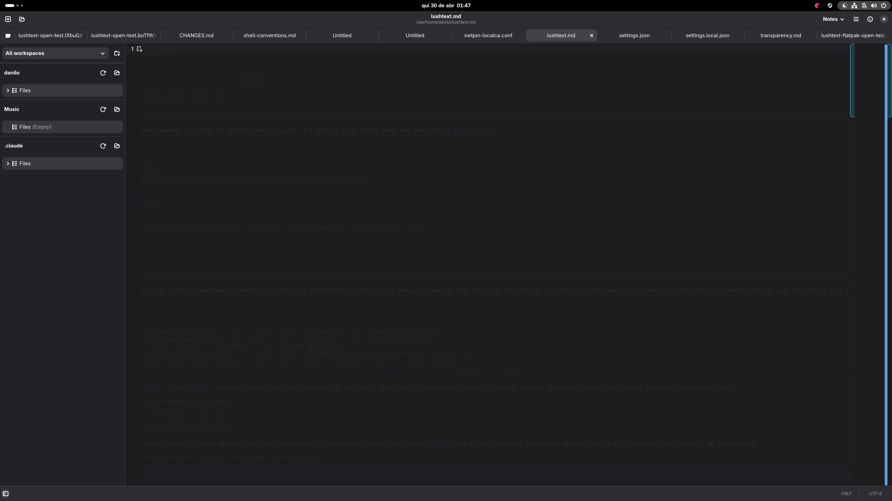

# LushText

A fast, minimalist text editor for GNOME built with Rust, GTK4, Libadwaita,
and GtkSourceView. LushText keeps the editing surface quiet while adding
project-friendly workspaces, document metadata, Markdown preview, notes,
local history, and careful recovery behavior.



## Features

### Everyday Editing

- **GtkSourceView editor** with syntax highlighting, dark-mode-aware schemes,
  line numbers, current-line highlighting, word wrap, zoom, print, and custom
  monospace font support.
- **Tabs and sessions** with restored open tabs, pinned state, cursor
  positions, scroll offsets, workspace state, search state, and recoverable
  drafts after restart or crash.
- **Safe file handling** with external-change detection, graceful large-file
  degradation, atomic saves, symlink-aware writes, and explicit durability
  warnings when the system cannot confirm a write fully reached storage.
- **EditorConfig support** for indentation and save-policy overrides, with
  Preferences values used as fallback.

### Workspaces and Navigation

- **Persistent workspaces** made of named, ordered folder sets. Use the
  workspace selector to view `All workspaces` or focus one workspace.
- **Workspace sidebar** with automatic refresh for visible folders, manual
  refresh buttons, deep-folder focus, file/folder creation, rename, delete,
  and a quick `Space` file peek before opening a tab.
- **Recent Open and command palette** via `Ctrl+K` and `Ctrl+Shift+P` for
  recent documents, workspace files, note records, and commands.
- **Workspace search** with streaming results, literal or regex modes,
  whole-word matching, `.gitignore` support, glob filters, saved searches,
  search history, match navigation, and previewable multi-file Replace All
  with undo during the active safety window.

### Writing, Notes, and History

- **Markdown support** with emphasized source headings plus side-by-side or
  full-width native preview for headings, links, lists, task lists, callouts,
  footnotes, tables, fenced code, and local images.
- **Focus Mode** via `Ctrl+Shift+F11`, with a reversible fullscreen writing
  shell, target column width, optional typewriter scrolling, and `Alt+P`
  preview-only support.
- **Bookmarks and rich notes** for saved files and workspace folders, including
  gutter marks, labels, bookmark navigation, document notes, folder notes, and
  a unified notes browser.
- **Local history** for saved files, with automatic baseline, periodic, and
  save-boundary snapshots, a read-only preview browser, restore safety
  snapshots, and one-click undo of a restore.

### Hidden Strengths

- **Accessibility and keyboard coverage** use GTK-native roles, names, states,
  keyboard parity, bounded announcements, AT-SPI smoke artifacts, and manual
  Orca guidance for the major app surfaces.
- **Automation spine** exposes a documented, read-only D-Bus snapshot and
  action catalog for same-user smoke tools without exposing document text,
  note bodies, drafts, local-history contents, or private sidecar IDs.
- **GTK Lush** is an in-tree internal platform for hardened GTK4/Libadwaita
  patterns, proof helpers, and adoption experiments. It is useful contributor
  context even though it is not published as stable external crates.
- **Soft live-editor memory budget** reacts to untitled and growing buffers,
  evicts only clean inactive files that can be reloaded, and preserves active,
  modified, loading, saving, failed-load, or otherwise non-recoverable work.

## Installation

### Cominotti Flatpak

Install the current public Flatpak from the Cominotti remote:

```sh
flatpak install --user https://flatpak.cominotti.dev/lushtext.flatpakref
flatpak run dev.cominotti.lushtext
```

The `.flatpakref` and shared `.flatpakrepo` include the Cominotti public GPG
key, so public install instructions should keep normal GPG verification
enabled.

Manual remote setup is also supported:

```sh
flatpak remote-add --user --if-not-exists --from cominotti https://flatpak.cominotti.dev/cominotti.flatpakrepo
flatpak install --user cominotti dev.cominotti.lushtext
```

### From This Checkout

Build and install the Flatpak from the current source tree:

```sh
make flatpak-install
flatpak run dev.cominotti.lushtext
```

The Flatpak uses `org.gnome.Platform` 50 and the matching GNOME SDK.
`make flatpak-install` adds the user Flathub remote when needed and installs
missing runtime, SDK, and Rust SDK-extension dependencies before building.
Use `make flatpak` for a build-only check. After dependency changes, refresh
the vendored Cargo sources with:

```sh
make cargo-sources
```

Release, Cominotti repository, Cloudflare Pages hosting, and optional Flathub
handoff details live in
[`docs/next/flatpak-packaging.md`](docs/next/flatpak-packaging.md) and
[`docs/next/cominotti-flatpak-hosting.md`](docs/next/cominotti-flatpak-hosting.md).

### Snap Status

An Ubuntu Snap scaffold exists at `snap/snapcraft.yaml`, but it is not ready
for users yet. LushText targets the GNOME 50 stack (GTK 4.22, Libadwaita 1.9,
GtkSourceView 5.18), while Snapcraft's GNOME extension/content-snap support
must also support the `core26`/GNOME 50 platform before the scaffold can become
a real release build.

Check the current external gates without mutating Snap Store state:

```sh
make snap-store-readiness
```

When the Snap becomes buildable, the intended posture is strict confinement,
Unlisted visibility, and the `edge` channel first.

## First Run

1. Open a file with `Ctrl+O`, search recent documents from the header-bar Open
   button or `Ctrl+K`, launch `lushtext PATH` from a source/host install, or
   use `flatpak run dev.cominotti.lushtext PATH` from the Flatpak.
2. Add a workspace folder from the left sidebar to browse a project directory.
3. Use the workspace selector to choose `All workspaces` or one workspace.
4. Open the command palette with `Ctrl+Shift+P` to search files, note records,
   and commands.
5. Open **Main Menu > Keyboard Shortcuts** for the built-in shortcut reference.

## Preferences

Preferences are stored with GSettings under `dev.cominotti.lushtext`.

### Editor

- **Color Scheme** selects the base GtkSourceView style scheme. Dark variants
  are chosen automatically when GNOME is in dark mode.
- **Use System Monospace Font** and **Custom Font** control editor and sidebar
  monospace text.
- **Background Opacity** adjusts editor and Markdown preview document
  backgrounds without making window chrome or side panels transparent.
- **Focus Mode** preferences set the target column width and optional
  typewriter scrolling.
- **Minimap** preferences control whether the document overview and long-line
  markers appear on supported files.
- **Use EditorConfig**, **Word Wrap**, **Tab Width**, **Insert Spaces Instead
  of Tabs**, **Show Line Numbers**, **Highlight Current Line**, and
  **Show Bookmark Gutter** control editing behavior and editor decorations.

### Workspace

- **Sidebar Width** chooses the `Small`, `Comfy`, or `Large` workspace sidebar
  preset.
- **Auto-Collapse Workspaces** collapses other workspace sections when focusing
  a folder.
- **Empty Folder Lookahead Cap** controls how many subdirectories LushText peeks
  into when deciding whether a folder should be marked `(Empty)`.

### Data

- **Data Format** checks LushText-owned app data for the current metadata
  format.
- **Rescan data formats** reruns that check from the Preferences dialog.
- **Update Data** appears only when supported older app data can be converted
  safely to the current format.

Advanced users can inspect or reset settings with:

```sh
gsettings list-recursively dev.cominotti.lushtext
gsettings reset-recursively dev.cominotti.lushtext
```

For Flatpak installs, run GSettings commands inside the sandbox:

```sh
flatpak run --command=gsettings dev.cominotti.lushtext list-recursively dev.cominotti.lushtext
flatpak run --command=gsettings dev.cominotti.lushtext reset-recursively dev.cominotti.lushtext
```

## Data, Privacy, and Reset

LushText keeps application state under `$XDG_DATA_HOME/lushtext` for source and
host installs. On typical systems this is `~/.local/share/lushtext`. Flatpak
installs keep app data inside the sandbox, normally under
`~/.var/app/dev.cominotti.lushtext/data/lushtext`.

Stored state can include document text:

| Path | Contains |
|------|----------|
| `session.json` | Open tabs, pinned state, cursor positions, and scroll offsets |
| `workspaces.json` | Saved workspace names and ordered folder sets |
| `recent-documents.json` | App-owned recent-document paths and timestamps |
| `drafts/` | Plain-text autosaved drafts for unsaved changes |
| `style-schemes/` | Generated opacity-aware GtkSourceView style schemes |
| `bookmarks/` | Saved-file bookmark metadata |
| `document-notes/` | Per-file document notes |
| `folder-notes/` | Per-folder note sidecars |
| `workspace-notes/` | Legacy-compatible folder-note sidecars from older releases |
| `local-history/` | Local-history snapshots for saved files |
| `migration-ledger.json` | Retryable sidecar and local-history migration work after in-app renames |
| `recovery-quarantine/` | Preserved malformed or unsupported app-owned recovery metadata |
| `search-history.json` | Recent workspace search queries and options |
| `saved-searches.json` | Named saved searches |
| `replace-backup-journal/` | Temporary per-file undo journal for multi-file Replace All |
| `replace-backup.json` | Legacy temporary Replace All undo file, cleared with stale journal state |
| `format-upgrade-backups/` | Preserved app-data files and manifests from Convert or Start Fresh format actions |

From a source checkout, the safest reset entry point is:

```sh
make clear-lushtext-xdg DRY_RUN=1
make clear-lushtext-xdg
```

The target removes only LushText-owned XDG paths and the Flatpak app-private
directory, then resets the `dev.cominotti.lushtext` GSettings schema when
available. Close LushText before resetting state.

Without a source checkout, close the app, remove the relevant app-data
directory, and reset GSettings if you also want preferences back at defaults.

## Flatpak Permissions

The Flatpak manifest grants host filesystem access because LushText is a local
workspace text editor that must open, save, search, rename, delete, and monitor
user-selected files and workspace folders across local paths, not only under
the home directory. It does not request network access.

Portal and sandbox diagnostics are intentionally observability-only for this
release line. `make check-flatpak-permissions` validates the source manifest,
and `make portal-sandbox-smoke` records runtime permission artifacts without
migrating LushText to portals-only access.

| Permission | Why it is used |
|------------|----------------|
| `--filesystem=host` | Open, save, search, rename, delete, and monitor user-selected local files and workspace folders across host paths |
| `--socket=wayland` | Native Wayland display support |
| `--socket=fallback-x11` and `--share=ipc` | X11 fallback support |
| `--device=dri` | GTK hardware-accelerated rendering |

The planned Snap uses strict confinement plus xdg portals instead. It declares
only the `home` and `removable-media` interfaces directly; paths outside those
locations must go through portals or surface a clear access error.

## Common Shortcuts

The built-in shortcut dialog is available in **Main Menu > Keyboard Shortcuts**.
Common accelerators include:

| Workflow | Shortcut |
|----------|----------|
| New file | `Ctrl+N` |
| Open file | `Ctrl+O` |
| Open recent documents | `Ctrl+K` |
| Save / Save As | `Ctrl+S` / `Ctrl+Shift+S` |
| Close tab | `Ctrl+W` |
| Print | `Ctrl+P` |
| Find / Find and Replace | `Ctrl+F` / `Ctrl+H` |
| Next / previous find match | `Ctrl+G` / `Ctrl+Shift+G` |
| Command palette | `Ctrl+Shift+P` |
| Workspace search | `Ctrl+Shift+F` |
| Workspace search next / previous match | `F4` / `Shift+F4` |
| Local History | `Ctrl+Alt+L` |
| Browse bookmarks / notes | `Ctrl+Alt+B` / `Ctrl+Alt+A` |
| Toggle / edit bookmark | `Ctrl+F2` / `Ctrl+Shift+F2` |
| Next / previous bookmark | `F2` / `Shift+F2` |
| Toggle minimap | `Ctrl+Shift+M` |
| Cycle invisible characters | `Ctrl+Shift+I` |
| Document properties | `F9` |
| Fullscreen | `F11` |
| Focus Mode | `Ctrl+Shift+F11` |
| Markdown preview-only mode | `Alt+P` |
| Zoom in / out / reset | `Ctrl++` / `Ctrl+-` / `Ctrl+0` |

## EditorConfig

LushText reads `.editorconfig` files from the opened file's directory upward.
Closer files take priority, and `root = true` stops the search.

| Property | Behavior |
|----------|----------|
| `indent_style` | `insert-spaces-instead-of-tabs` |
| `tab_width` | `tab-width` (clamped 1-12) |
| `indent_size` | `indent-width` (clamped 1-12) |
| `end_of_line` | Save-time line ending (`lf`, `crlf`, or `cr`) |
| `charset` | Save encoding for `utf-8`, `utf-8-bom`, `utf-16be`, and `utf-16le`; `latin1` is ignored rather than approximated |
| `trim_trailing_whitespace` | Save-time removal of trailing spaces and tabs |
| `insert_final_newline` | Save-time final-newline policy for non-empty documents |

`max_line_length` is not yet enforced. See
[`docs/next/editorconfig-future.md`](docs/next/editorconfig-future.md) for
planned follow-up work and remaining caveats.

## Notes, History, and Preview

Bookmarks and document notes require a saved file path. Folder notes require a
concrete workspace folder. `All workspaces` keeps the unified notes browser
available, but direct folder-note editing is enabled only when a concrete
workspace folder is selected.

Sidecars live under `$XDG_DATA_HOME/lushtext/bookmarks/`,
`$XDG_DATA_HOME/lushtext/document-notes/`, and
`$XDG_DATA_HOME/lushtext/folder-notes/`; older
`$XDG_DATA_HOME/lushtext/workspace-notes/` folder-note sidecars remain
legacy-compatible. **Save As** starts a new file-backed identity, while sidebar
renames inside LushText migrate file-backed and folder-note sidecars.

Local history is available for saved files. It captures a baseline when a clean
saved document first becomes modified, captures additional modified-session
snapshots at a bounded cadence, and records successful save-boundary snapshots.
Files above `10 MB` use save-boundary capture only, and files above `50 MB`
disable local history.

Markdown preview is available for Markdown files from **Main Menu > Markdown
Preview** or `Alt+P` for preview-only mode. Canonical sample content lives in
[`samples/markdown-test.md`](samples/markdown-test.md).

The preview renders in bounded slices so a long document never blocks the UI,
and a large table, list, code block, blockquote, or definition list is rendered
completely across those slices as one continuous block. When a single unit is
too dense to render — one enormous paragraph, heading, or table row — only that
unit is replaced by an in-place marker; its siblings and the rest of the
document still render, and the preview reports that it completed with a count of
simplified units. A very large table or code block keeps its existing behavior
of being replaced by one summary widget naming its true size. Whole-document
ceilings (4 MiB of source, 50,000 parser elements, 128 levels of nesting) still
stop the preview and say so.

## Building from Source

### Dependencies

- Rust 1.96.0+
- GTK4 development libraries
- Libadwaita development libraries
- GtkSourceView 5 development libraries
- GLib development tools (`glib-compile-schemas`)

On Fedora:

```sh
sudo dnf install gtk4-devel libadwaita-devel gtksourceview5-devel glib2-devel
```

On Ubuntu/Debian:

```sh
sudo apt install libgtk-4-dev libadwaita-1-dev libgtksourceview-5-dev libglib2.0-dev
```

Prepare the full local development environment, including Flatpak runtime/SDK
dependencies, Blueprint tooling, headless GTK test helpers, and desktop
debugging tools:

```sh
make dev-tools
```

On Fedora Toolbx this uses `sudo dnf install`. It does not layer packages onto
a Silverblue host unless `LUSHTEXT_DEV_TOOLS_ALLOW_RPM_OSTREE=1` is set.

### Common Developer Commands

```sh
make build       # Release build
make build-debug # Debug build
make run         # Debug build + fresh GNOME desktop staging
make test        # Unit + integration + widget tests
make check       # fmt + all-feature Clippy + fast policy audits
make pre-commit  # repo pre-commit gate
make install-git-hooks
```

`make run` asks any already-running LushText instance to quit before launching
the freshly built debug binary. If the existing app refuses to close, the
launcher fails instead of activating stale code.

Run `make install-git-hooks` once per checkout to configure the repo-managed
hooks in `.githooks/`.

### UI Templates

UI templates are authored in Blueprint (`resources/ui/*.blp`). The generated
GtkBuilder XML files (`resources/ui/*.ui`) stay committed and remain the
runtime GResource inputs for direct Cargo, Meson, Flatpak, and Snap builds.
Do not hand-edit generated `.ui` files; edit the matching `.blp`, then run:

```sh
make blueprint-generate
make check-blueprint
```

## Contributor Map

Cargo workspace:

- `crates/lushtext-build-support` - build-script helper crate.
- `crates/lushtext-core` - application logic: domain models, services, and GTK
  widgets. Its main-window adapter keeps pure responsive policy in
  `ui/window/adaptive_shell.rs`, keeps draft intent epochs in
  `ui/window/draft_ordering.rs`, bounds progressive tab restoration in
  `ui/window/session_restore.rs`, and divides note workflows between the private
  `ui/window/notes/{bookmarks,editors,browser}.rs` modules. The Markdown preview
  adapter is likewise split under `ui/markdown_preview/` into behavior-neutral
  workflow siblings (`images.rs`, `tables.rs`, `code_blocks.rs`, `links.rs`,
  `inline_footnotes.rs`, plus `continuation.rs` for the generation-owned
  cross-turn projection state and `text_flow.rs` for its stateless text-flow
  primitives) around the render-orchestration `mod.rs`. Recycled workspace
  row wiring is split under `ui/sidebar/workspace_section/` into
  `row_factory.rs`, `row_accessibility.rs`, and `context_menus.rs`. Plain policy
  for per-store scan ownership, weighted disposal, and minimap analysis lives
  in `model/{workspace_scan,workspace_search,workspace_persistence,plain_disposal,minimap_analysis}.rs`.
- `crates/lushtext` - thin binary entry point plus integration tests.
- `crates/gtk-lush/` - governed `0.0.0` GTK Lush family crates for extracting
  reusable GTK4/Libadwaita patterns. These are functional in-tree APIs, not
  stable external dependencies.
- `crates/gtk-lush-adoption-lab` - maintained second-consumer GTK app for GTK
  Lush adoption validation.
- `crates/cargo-gtk-proof` - workspace visual proof tool outside the GTK Lush
  family.
- `workspace-hack` - generated cargo-hakari crate for unified dependency
  features.

Inside that layering, one *workflow* — a single user-initiated operation with
ordered stages, such as save, workspace search, or draft recovery — is arranged by
role so its whole story stays in one place:

- a **narrative facade** (the workflow's public module surface) that narrates the
  ordered stages, delegates each one, and names every point where control resumes
  from an idle drain, timer, or worker completion;
- **seam value objects** for identity/freshness/intent bundles that cross two or
  more boundaries, constructed once at the entry point and validated as a unit;
- co-located pure **`policy.rs`** with no GTK-family imports, which keeps it in
  mutation-testing scope wherever its workflow lives;
- **coordination** modules named for the job they do (`admission`, `execution`,
  `retirement`, `watch`);
- one typed **`evidence.rs`** surface that is the workflow's observable state:
  tests read it, and the read-only D-Bus automation snapshots project from it
  without changing the exported contract.

`crates/lushtext-core/src/ui/search_panel/` is the first workflow arranged this
way and is the reference example: `mod.rs` narrates the search and Replace All
stages, `policy.rs` holds the pure single-flight, retirement-budget, and
preview-freshness policy, `execution.rs`/`retirement.rs`/`replace.rs` are its
coordination jobs, and `evidence.rs` is the surface its widget tests and the
`window.content_search` automation snapshot both read.

Migration to this shape is a staged programme. Per-workflow status, owned pure
policy, seam value objects, risk tiers, and migration slots live in
[`docs/workflow-readability-matrix.md`](docs/workflow-readability-matrix.md), and
`make check-workflow-boundaries` checks conformance. Unmigrated workflows are
behaviorally unchanged. The programme's rationale, measured baseline, remaining
per-change scope, and deferred work are recorded in
[`docs/next/workflow-readability.md`](docs/next/workflow-readability.md).

Automation surfaces are documented in [`docs/automation.md`](docs/automation.md)
and [`docs/automation-reference.md`](docs/automation-reference.md). The
developer/agent client is `scripts/lushtext-automation.py`.

GTK Lush governance lives in
[`crates/gtk-lush/GOVERNANCE.md`](crates/gtk-lush/GOVERNANCE.md), with the
umbrella vision in [`docs/next/gtk-lush.md`](docs/next/gtk-lush.md). Adoption
evidence lives in [`docs/gtk-lush-adoption/`](docs/gtk-lush-adoption/). Use the
family-specific checks when touching that area:

```sh
make check-gtk-lush-policy
make check-gtk-lush-adoption
make gtk-lush-doctests
make gtk-lush-examples
make gtk-lush-msrv
make gtk-lush-api-advisory
```

## Testing and Proof

The normal local baseline is:

```sh
make test
make check
```

Widget tests require a display server; the repo runner uses the private
headless Mutter path for deterministic full-suite runs. For host-sensitive
risks that the widget harness cannot honestly prove, use the smoke lanes in
[`docs/end-user-coverage.md`](docs/end-user-coverage.md), including visual,
automation, crash-recovery, portal/sandbox, accessibility, and performance
smoke coverage.

Benchmarks cover performance-sensitive service code such as bounded command
palette ranking and cancellation, fuzzy search, file indexing, directory
scanning, save admission, Markdown planning, workspace-search ownership,
result retirement, editor residency, and encoding analysis. The palette guide
lives in [`docs/benchmarks/search-pipeline.md`](docs/benchmarks/search-pipeline.md),
and the cross-pipeline resource evidence lives in
[`docs/benchmarks/bounded-interactive-pipelines.md`](docs/benchmarks/bounded-interactive-pipelines.md):

```sh
make bench
make bench-report
```

## Tech Stack

| Component | Technology |
|-----------|------------|
| Language | Rust 1.96.0+, Edition 2024 |
| GUI | GTK4 0.11 + Libadwaita 0.9 + GtkSourceView 5 0.11 |
| Config | GSettings |
| Build | Cargo workspace + Makefile (dev), Meson (Flatpak/installed) |
| Packaging | Flatpak (`org.gnome.Platform` 50); Snap scaffold in preparation |
| License | GPL-3.0-or-later |

## License

LushText is licensed under the
[GNU General Public License v3.0 or later](https://www.gnu.org/licenses/gpl-3.0.html).
