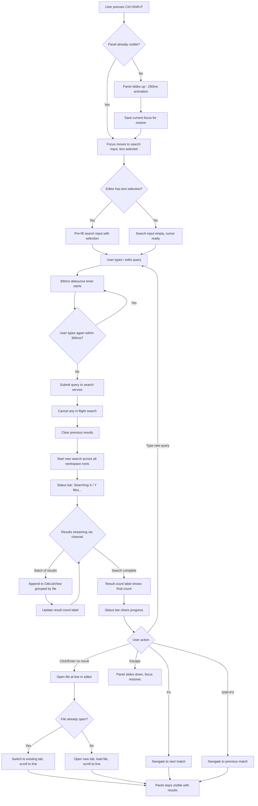
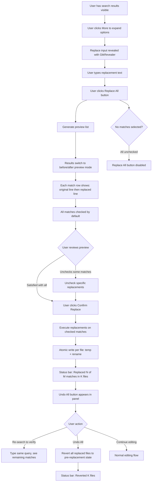
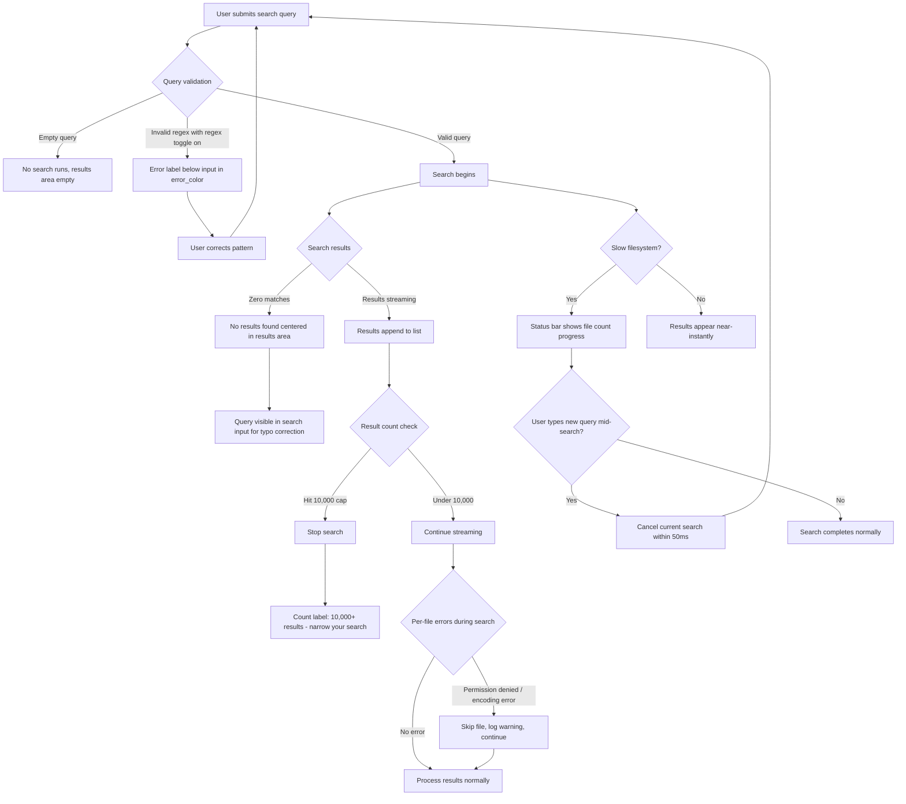
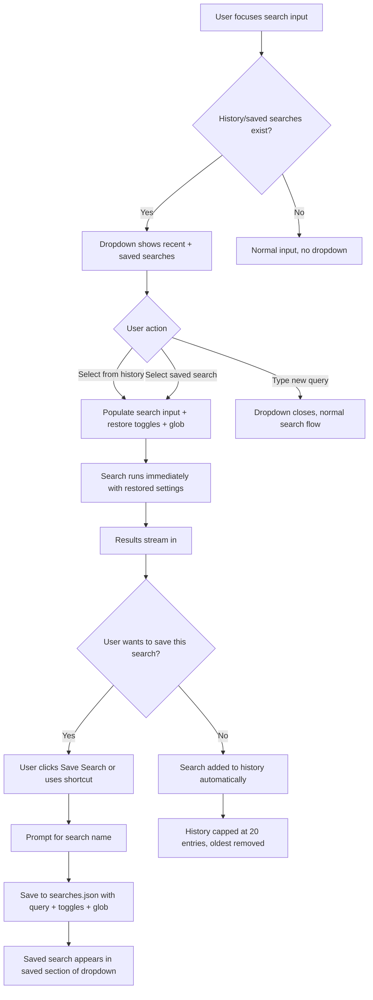

# UX Design Specification lushtext

**Author:** Danilo
**Date:** 2026-04-06

---

## Executive Summary

### Project Vision

LushText is a minimalist, fast text editor targeting GNOME/Libadwaita that combines the clean aesthetics of GNOME Text Editor with power-user features: a multi-workspace file tree sidebar, and now, workspace-wide content search at ripgrep-class speed. The content search feature (`Ctrl+Shift+F`) is the single largest UX addition to date — it transforms LushText from a file editor into a workspace-aware tool.

The design language follows GNOME HIG conventions as the primary vocabulary, with Sublime Text's speed-first minimalism as secondary inspiration. This is deliberately not a VS Code search panel port. Users who chose a GNOME-native editor did so for a reason; every UX decision must honor that choice.

The broader product vision includes adaptive sidebar, split panes, minimap, distraction-free mode, inline terminal, bookmarks/annotations, file peek, session time travel, workspace context switching, and an encoding toolkit — all following the same GNOME-native, keyboard-first design philosophy.

### Target Users

**Marco the Developer** — Backend developer working across multiple workspace roots (application crate, shared library, deployment configs, docs). Needs to search 200+ files for error messages, constants, and patterns. Primary workflows: find-and-navigate (search → click → edit) and multi-file refactoring (search → Replace All with preview). Values speed and keyboard efficiency.

**Lucia the Writer** — Technical writer maintaining documentation workspaces (300+ markdown files) and personal notes (150+ mixed files). Needs to rediscover forgotten content across heterogeneous document collections. Primary workflows: content discovery (search → glob filter → browse results) and weekly review (saved searches with pre-configured options). Values comprehensiveness and low friction.

**Tomás the Sysadmin** — Systems administrator managing server configurations across Ansible playbooks, Nginx configs, and environment files. Needs to find every occurrence of a value to identify source-of-truth vs stale copies. Primary workflows: audit (search → scan grouped results without clicking) and verification (re-search after edits). Values result grouping and multi-root coverage.

All three personas are technically proficient Linux/GNOME desktop users who prefer keyboard-driven interaction, expect sub-second response times, and chose a native GTK editor over Electron alternatives for a reason.

### Key Design Challenges

1. **Panel placement in a complex layout** — The window already contains HeaderBar, TabBar, a horizontal GtkPaned (sidebar + content Stack with editor/preview), and StatusBar. The search panel introduces a new region that must coexist without cramping the editing space. The PRD specifies a GtkRevealer below the content stack, inside the sidebar-content split — positioning it below the editor but above the status bar.

2. **Streaming results coherence** — Results arrive asynchronously via channel-based streaming (up to 50 results per 50ms tick), grouped by file in a GtkTreeListModel. The UI must handle transitions from "searching..." to partial results to completion smoothly — no jarring scroll jumps, no result repositioning, no "lost my place" moments during rapid result arrival.

3. **Replace All trust and safety** — Multi-file replacement is high-stakes (potential data loss across many files). The preview list with per-item checkboxes, confirmation step, and Undo All button must together create enough confidence that users actually use the feature rather than falling back to per-file find/replace.

4. **GNOME-native identity vs power-user density** — The search panel needs information density (query, toggles, glob filter, results with context, replace field, progress) within a GNOME HIG-compliant layout. Resisting the temptation to port VS Code's dense sidebar panel or Sublime's minimal overlay requires finding a LushText-specific balance.

5. **Keyboard/mouse parity** — Keyboard-first workflow (`Ctrl+Shift+F` → type → `F4` → Enter) and mouse workflow (open panel → type → click result) must both feel natural and complete, without either being a degraded version of the other.

### Design Opportunities

1. **"The editor already knows" perception** — Results streaming in *before the user finishes typing* (300ms debounce + sub-500ms first results) creates the primary delight moment. The UI should amplify this by making result appearance feel instant and natural, not jarring.

2. **First-in-class for GNOME** — No GTK text editor offers workspace-wide content search. LushText can define the pattern rather than replicate an existing one, potentially influencing future GNOME editor UX.

3. **Noise-free by default** — `.gitignore` awareness, binary file skip, and the 10,000 result cap with truncation guidance mean results are clean without any user configuration. This is a rare UX win: better defaults eliminate the need for UI affordances.

4. **Consistent animation language** — LushText already has established animation patterns (sidebar toggle, preview pane, command palette) using `AdwTimedAnimation` + `EaseOutCubic` at 250ms. The search panel can join this family for a cohesive, polished feel.

## Core User Experience

### Defining Experience

The core experience of LushText's content search is the **search-navigate loop**: a single continuous action from "I need to find something" to "I'm editing it." The loop has four beats:

1. **Invoke** — `Ctrl+Shift+F` opens the panel with cursor in the search field. Zero setup.
2. **Query** — Type a few characters. Results stream in before the query is complete.
3. **Scan** — Grouped-by-file results with highlighted matches let the user triage visually without clicking.
4. **Navigate** — Activate a result (click or `F4` + Enter) to land on the exact line in the editor. The panel stays visible for continued exploration.

The defining quality is **continuity** — no step feels like leaving the previous one. The panel doesn't close. The editor doesn't scroll away. Focus flows naturally between search input, results list, and editor.

### Platform Strategy

- **Platform:** Linux desktop (GNOME/GTK4/Libadwaita), single platform
- **Input:** Keyboard-primary with full mouse parity. Every action accessible via both keyboard shortcut and mouse click. Neither pathway is a degraded version of the other.
- **Distribution:** Flatpak (primary), system package (secondary). Content search operates within Flatpak filesystem sandbox — searches only directories the user has granted access to.
- **Offline:** Not applicable — all search is local filesystem. No network dependency.
- **Display:** Standard desktop monitors. No responsive/mobile considerations for MVP (adaptive sidebar is a separate future feature).

### Effortless Interactions

These interactions must require zero thought from the user:

1. **Panel lifecycle** — `Ctrl+Shift+F` opens with cursor ready. Escape closes and restores focus to the editor. No intermediate states, no "where did my cursor go?" moments.
2. **Default filtering** — `.gitignore` patterns respected, binary files skipped, `node_modules`/`target`/`vendor` excluded. The first search returns clean, relevant results without any configuration.
3. **Result comprehension** — File grouping, line numbers, and match highlighting make each result self-explanatory at a glance. Tomás can triage 14 matches across 8 files without clicking a single one.
4. **Mid-search correction** — Typing a new query while results are streaming cancels the old search and starts fresh. No "wait for it to finish" friction. No cancel button hunting.
5. **Session continuity** — Search panel visibility, last search options, and toggle states persist across application restarts. Monday morning, the panel is exactly where it was Friday evening.

### Critical Success Moments

1. **The "already knows" moment** — User types 3-4 characters and results are streaming in. The editor feels prescient. This is the primary delight moment and the #1 reason users will prefer LushText over alt-tabbing to a terminal.
2. **The "found it" moment** — User activates a result and lands on the exact line, syntax-highlighted, cursor positioned. The file was already open (tab switch) or opens instantly (new tab). Zero disorientation.
3. **The "it's all here" moment** — A multi-root search surfaces matches across all workspace directories, including files the user forgot existed. Lucia finds her 6-month-old OAuth notes. Comprehensiveness creates trust.
4. **The "safe replace" moment** — Marco reviews the Replace All preview, unchecks one result, clicks Replace, and sees "Replaced 8 of 9 matches in 5 files." He trusts the operation because he saw exactly what would change before it happened.
5. **The "clean results" moment** — First search in a new workspace returns only relevant source files, not thousands of hits in `node_modules`. The user didn't configure anything — it just worked.

### Experience Principles

These principles guide all UX decisions for the content search feature:

1. **Speed is the feature** — Perceived speed matters more than raw throughput. Streaming results, instant cancellation, and sub-second first results create the impression that the editor already knows the answer. Every design decision that trades speed perception for visual polish is wrong.

2. **The panel is a companion, not a dialog** — The search panel coexists with the editor, not replaces it. It stays visible during navigation, remembers its state, and never interrupts the editing flow. Opening the panel is joining a conversation, not starting a transaction.

3. **Clean by default, powerful on demand** — The first search with zero configuration must return useful, noise-free results. Toggle buttons (regex, case, word), glob filters, and saved searches are available but never required. Progressive disclosure: simple → toggle → filter → save.

4. **Trust through transparency** — Replace All earns user trust by showing every proposed change before execution. Progress reporting ("Searching 1,234 / 5,678 files...") earns trust during long operations. Truncation indicators ("10,000+ results — narrow your search") earn trust by being honest about limits.

5. **One animation language** — Panel reveal, result streaming, match navigation, and all transitions use the same `AdwTimedAnimation` + `EaseOutCubic` + 250ms vocabulary as the rest of LushText. The search panel should feel like it was always part of the application, not bolted on.

## Desired Emotional Response

### Primary Emotional Goals

**Effortless competence** — The user feels like a power user without trying. Content search makes advanced capabilities feel natural and obvious, not learned. The dominant reaction should be "of course it does this" rather than "wow, what a feature." This is the emotional signature of well-integrated GNOME software: capability without ceremony.

**Flow continuity** — The search-navigate loop never breaks the user's sense of being "in the zone." Opening the panel, scanning results, navigating to a match — each transition feels like continuing the same thought, not starting a new task.

**Quiet trust** — The user trusts the results are complete, trusts the Replace All preview is accurate, and trusts that closing the panel won't lose their search state. Trust is built through consistency and transparency, never through reassurance dialogs or confirmation prompts (except Replace All, where the stakes justify it).

### Emotional Journey Mapping

| Stage | Target Emotion | Design Driver |
|-------|---------------|---------------|
| **Invoke** (`Ctrl+Shift+F`) | Anticipation → Readiness | Instant panel with cursor in search field. Zero setup friction. The user is "ready to search" within 250ms of the keypress. |
| **Query** (typing) | Surprise → Delight | Results streaming in before the query is finished. The "already knows" moment — the primary delight driver. |
| **Scan** (reviewing results) | Confidence → Clarity | Clean file grouping, highlighted matches, line numbers. The user can triage without clicking. Information density serves comprehension, not overwhelm. |
| **Navigate** (activating result) | Satisfaction → Flow | Landing on the exact line, syntax-highlighted, cursor positioned. The panel stays visible. Context is preserved, not lost. |
| **Replace All** (preview → execute) | Caution → Trust → Relief | Preview list shows every change. Checkboxes give per-item control. "Replaced 8 of 9 in 5 files" confirms success. Undo All is available but not prominent — trust means rarely needing the safety net. |
| **Error** (invalid regex, no results, truncation) | Calm → Guided | Inline error messages, not crash or dialog. "No results found" with query visible so the user can spot typos. "10,000+ results — narrow your search" guides without scolding. |
| **Return** (reopening panel later) | Recognition → Continuity | Panel remembers visibility, last query, toggle states. Monday morning, the workspace is exactly where it was Friday. No "where was I?" disorientation. |

### Micro-Emotions

**Confidence over Confusion** — Results are self-explanatory at a glance. File paths, line numbers, and highlighted matches eliminate "what am I looking at?" moments. The user never wonders whether the search is complete, still running, or failed silently.

**Trust over Skepticism** — Progress reporting ("Searching 1,234 / 5,678 files...") makes the system's work visible. Truncation is honest ("10,000+ results"). Replace All shows every proposed change. The user never wonders "did it really search everything?"

**Accomplishment over Frustration** — Even edge cases feel productive. Zero results shows the query for easy typo correction. Invalid regex shows a specific error message. Slow filesystems show progress. Every state has a clear next step.

**Belonging over Foreignness** — The search panel looks like it was designed by the GNOME team. Adwaita widgets, HIG layout, consistent animation language. Nothing triggers "this was copied from VS Code." Users who chose LushText over Electron editors feel validated, not compromised.

### Design Implications

| Emotional Goal | UX Design Approach |
|---------------|-------------------|
| Effortless competence | Progressive disclosure — simple search works with zero configuration. Toggles, globs, and saved searches are visible but never required. |
| Flow continuity | Panel stays visible after navigation. Focus flows naturally between search input, results, and editor. No modal dialogs interrupt the loop. |
| Quiet trust | Transparent progress reporting. Honest truncation indicators. Complete Replace All preview. No "are you sure?" dialogs except for destructive operations. |
| Delight through speed | Streaming results with sub-500ms first appearance. Instant cancellation. 300ms debounce keeps the UI responsive without making the user wait. |
| Calm in errors | Inline error states (not dialogs). Every error state has a visible recovery path. No panics, no cryptic messages, no dead ends. |
| Belonging | Adwaita widgets throughout. `@accent_color`, `@warning_color`, `@error_color` tokens. `AdwTimedAnimation` + `EaseOutCubic` + 250ms for all transitions. `.caption` CSS class for secondary text. |

### Emotional Design Principles

1. **Understated excellence** — The best features feel invisible. Content search should feel like a natural capability the editor always had, not a bolted-on feature. No fanfare, no onboarding tooltip, no "new feature!" badge. It's just there when you need it.

2. **Errors are conversations, not dead ends** — Every error state (invalid regex, no results, truncation, permission denied) should feel like the editor is helping the user refine their intent, not rejecting their input. Show what went wrong, show the recovery path, keep the user in flow.

3. **Transparency builds trust silently** — Progress reporting, truncation indicators, and Replace All previews don't feel like safety features — they feel like the editor being respectful of the user's time and data. Trust is earned through consistent transparency, not through reassurance.

4. **Speed is an emotion** — Sub-second response times don't just save time — they create the feeling that the editor understands the user. Streaming results that appear before the query is finished transform a utility into a delight. Protect perceived speed above all other polish priorities.

## UX Pattern Analysis & Inspiration

### Inspiring Products Analysis

**Sublime Text — Speed-first search panel**

Sublime's `Ctrl+Shift+F` opens a bottom panel with a search input, replace field, toggle buttons (regex, case, word), and a "Where" field for path filtering. Results render as a plain text buffer — file headers with match lines below, navigable with F4/Shift+F4. The defining quality is speed: results appear as you type with near-zero latency on large codebases. The panel is minimal — no tree structure, no expand/collapse, no icons. Just text, fast.

- *What it does well:* Speed perception. The bottom panel doesn't compete with the editor's primary viewport. F4 match navigation is fluid. The "Where" field for path filtering is powerful and concise.
- *What it lacks:* No file grouping beyond text headers. No match highlighting within result lines. No Replace All preview — replacement is immediate and destructive. No progress reporting. The results-as-buffer approach is functional but visually flat.
- *Relevance:* The speed standard and bottom-panel placement are directly transferable. The lack of structure and preview are gaps LushText should fill.

**VS Code — Rich sidebar search**

VS Code's `Ctrl+Shift+F` opens a sidebar panel with search input, replace field, toggle buttons, file include/exclude fields, and a TreeView of results grouped by file. Each file is an expandable node showing match lines with the matching text highlighted in yellow. Replace All shows inline previews (strikethrough old, green new) directly in the results tree. Preserves search state across sessions.

- *What it does well:* File grouping with expand/collapse. Match highlighting in results. Replace All with inline preview (no separate dialog). File include/exclude filters. Result count badges on file headers ("3 results"). Undo integration (Ctrl+Z reverts replacements per file).
- *What it lacks:* The sidebar placement steals horizontal space from the editor permanently. Information density is high but visually cluttered — many small icons, badges, and buttons in tight space. The search panel feels like a developer tool, not a general-purpose feature. Non-GNOME aesthetic.
- *Relevance:* File grouping, match highlighting, and Replace All preview are directly transferable patterns. The sidebar placement and visual density are anti-patterns for LushText.

**ripgrep (CLI) — The performance benchmark**

`rg` is the speed standard: parallel file traversal via `ignore` crate, SIMD-accelerated regex, memory-mapped I/O, `.gitignore` awareness by default. Output groups matches by file with colored highlighting. It's what LushText's service layer is built on (same `grep-searcher`, `grep-regex`, `ignore` crates).

- *What it does well:* Speed (orders of magnitude faster than grep). Clean defaults — `.gitignore` respected, binary files skipped, hidden files excluded. Grouped output by file. Colored match highlighting. Graceful degradation on errors (per-file warnings, search continues).
- *What it lacks:* No GUI. No click-to-open. No Replace All. No saved searches. The gap between "fast search" and "acting on results" is the entire reason LushText's content search exists.
- *Relevance:* The same crate ecosystem powers LushText's service layer. The speed expectations, default filtering behavior, and per-file error resilience are directly transferable. The "bridge the gap to GUI" is LushText's core opportunity.

**GNOME Text Editor — Visual language reference**

GNOME Text Editor defines LushText's visual target. It uses AdwOverlaySplitView, Adwaita widgets throughout, and follows HIG conventions precisely. It has no content search — only per-file Ctrl+F. Its search bar uses a GtkSearchBar-style revealer at the top of the editor.

- *What it does well:* Clean, uncluttered Adwaita aesthetic. The per-file search bar is minimal and non-intrusive. Animations are smooth and consistent. The overall feel is "calm and competent."
- *What it lacks:* No workspace concept. No content search. No multi-file operations. It's a single-file editor.
- *Relevance:* The visual language, animation style, and overall "calm competence" aesthetic are the primary design reference. The per-file search bar's revealer pattern is already replicated in LushText's Ctrl+F. The content search panel should feel like a natural extension of this aesthetic.

**GNOME Builder — GTK-native IDE search**

GNOME Builder is the closest GTK-native app with workspace-wide search. It uses a sidebar "search and replace" panel with file-grouped results. Built on GtkSourceView like LushText.

- *What it does well:* Proves that GTK4 can handle search result TreeViews at scale. Uses GtkSourceView's built-in search infrastructure. GNOME-native aesthetic.
- *What it lacks:* Search speed is significantly slower than ripgrep. The panel layout is IDE-oriented — assumes a broader chrome context (panels, debugger, build output) that LushText doesn't have.
- *Relevance:* Validates the GTK4 TreeListModel approach for search results. Confirms that GtkListView handles large result sets with widget recycling. The IDE layout assumptions are not transferable.

### Transferable UX Patterns

**Navigation Patterns:**

- **Bottom panel placement** (Sublime) — Search results below the editor, not beside it. Preserves full editor width for code viewing. The PRD specifies this: GtkRevealer inside the content stack's end child, below editor, above status bar. This is the right call — it avoids the "sidebar tax" that VS Code imposes.
- **F4/Shift+F4 match navigation** (Sublime, VS Code) — Sequential match cycling across files without losing panel state. Already specified in the PRD. The key detail: F4 should work from both the results list and the editor, so the user doesn't need to refocus the panel to continue navigating.

**Interaction Patterns:**

- **File-grouped TreeListModel** (VS Code) — Results grouped by file as expandable tree nodes, with match count on the file header row. This is the standard for structured search results and works naturally with GTK4's GtkTreeListModel + GtkTreeExpander. Each file row shows path + match count; each match row shows line number + highlighted line content.
- **Inline Replace All preview** (VS Code) — Show the original and replacement inline in the results tree, with checkboxes per match. VS Code does this with strikethrough + green text directly in the result rows. For LushText, this can be a toggle view mode: "Preview Replacements" switches the result display to show before/after per line.
- **Search-as-you-type with streaming** (Sublime) — Results begin appearing before the user stops typing. Combined with debounce (300ms), this creates the "already knows" perception. The key: results append at the bottom of the list without scrolling — the user's viewport stays stable.

**Visual Patterns:**

- **Match highlighting via Pango markup** (VS Code-inspired, GNOME-native implementation) — The matching text within each result line is highlighted using `@accent_color` weight, making it visually distinct without using VS Code's yellow background. This uses Adwaita's semantic color tokens for automatic light/dark mode support.
- **`.caption` CSS class for metadata** (GNOME HIG) — File paths, line numbers, and result counts use the Adwaita `.caption` class (smaller, dimmed text) to create visual hierarchy without custom fonts or colors.
- **Result count badge** (VS Code) — Each file header row shows a match count (e.g., "pool.rs — 3 matches"). Simple, informative, scannable.

### Anti-Patterns to Avoid

1. **Sidebar search panel** (VS Code) — Placing search results in a sidebar steals permanent horizontal space from the editor. In LushText, the sidebar is already occupied by the file tree. A second sidebar panel would squeeze the editor to an unusable width. Bottom panel preserves the full editor width.

2. **Dense icon-heavy controls** (VS Code) — VS Code packs toggle icons, action buttons, file count badges, expand/collapse icons, and replace previews into a narrow sidebar. The result is functional but visually noisy. LushText should use Adwaita toggle buttons with text labels where space permits, and rely on spacing rather than separators for visual grouping.

3. **Immediate destructive Replace All** (Sublime) — Sublime's Replace All executes immediately with no preview. Users who miss a match pattern can corrupt files. LushText must show a preview before execution, matching the emotional goal of "quiet trust."

4. **Results as plain text buffer** (Sublime) — Sublime renders search results as a plain text buffer with no structure. This works for speed but sacrifices navigability — no expand/collapse, no click-to-open, no match highlighting. LushText's GtkTreeListModel approach provides structure without sacrificing speed.

5. **Modal search dialog** (Eclipse, older IDEs) — A dialog window that blocks editing while searching. This fundamentally violates the "companion, not dialog" experience principle. LushText's panel is non-modal and stays visible during navigation.

6. **Eager scroll-to-first-result** (many apps) — Automatically scrolling the results list to show the first match as it arrives can be disorienting when results stream in rapidly. The list should grow naturally from the top without forcing the viewport to jump.

### Design Inspiration Strategy

**What to Adopt:**

- Sublime's **bottom panel placement** — preserves editor width, proven ergonomic for search workflows
- VS Code's **file-grouped TreeListModel** — structured results with expand/collapse, match count per file
- VS Code's **Replace All preview with checkboxes** — per-item control before execution
- ripgrep's **default filtering** — `.gitignore` respected, binary files skipped, zero configuration
- GNOME Text Editor's **visual language** — Adwaita widgets, semantic color tokens, smooth animations, calm aesthetic
- Sublime's **F4/Shift+F4 navigation** — cross-file match cycling without panel focus requirement

**What to Adapt:**

- VS Code's **inline Replace preview** → adapt to a toggle view mode within the existing results list, using Pango markup for before/after display rather than VS Code's strikethrough + green approach
- Sublime's **"Where" field** → adapt to a file glob filter (`GtkEntry` with placeholder "*.rs, *.toml") integrated into the panel header, using the `ignore` crate's glob support
- VS Code's **search history** → adapt to a dropdown on the search entry (GtkEntry's built-in completion or a custom popover) with both recent queries and saved/named searches

**What to Avoid:**

- VS Code's **sidebar placement** — conflicts with LushText's file tree sidebar, steals editor width
- Sublime's **destructive Replace All** — conflicts with trust emotional goal
- VS Code's **icon density** — conflicts with GNOME HIG and "belonging" emotional goal
- Any **modal dialog** approach — conflicts with "companion, not dialog" experience principle
- **Automatic scroll-to-result** on streaming — conflicts with flow continuity during rapid result arrival

## Design System Foundation

### Design System Choice

**Adwaita (Libadwaita 1.8+ / GTK4)** — GNOME's native design system. This is a platform-determined choice, not a selection among alternatives. LushText is a Libadwaita application; every widget inherits Adwaita styling, color tokens, typography, and interaction patterns automatically.

The content search panel introduces no custom design system. It uses standard Adwaita components (GtkEntry, GtkToggleButton, GtkListView, GtkTreeExpander, GtkRevealer, GtkLabel) composed into a new layout. The only custom visual treatment is Pango markup for match highlighting within result rows.

### Rationale for Selection

1. **Platform mandate** — GTK4/Libadwaita applications use Adwaita. Diverging would break theme consistency, dark mode support, high-contrast mode, and accessibility features that Adwaita provides for free.
2. **Emotional goal alignment** — The "belonging" emotional goal requires the search panel to look like GNOME designed it. Using non-standard components would immediately trigger the "foreignness" anti-emotion.
3. **Zero design overhead** — Adwaita's semantic color tokens (`@accent_color`, `@warning_color`, `@error_color`, `@window_bg_color`, `@headerbar_bg_color`) automatically adapt to light/dark mode and user accent color preferences. No manual theme management needed.
4. **Accessibility built-in** — Standard Adwaita widgets provide AT-SPI accessibility (screen reader support, keyboard navigation, focus indicators) without explicit implementation effort.

### Implementation Approach

**Standard Adwaita components for the search panel:**

| Panel Element | Widget | Adwaita Treatment |
|--------------|--------|-------------------|
| Search input | `GtkSearchEntry` | Built-in search icon, clear button, Escape-to-clear |
| Toggle buttons (regex, case, word, gitignore) | `GtkToggleButton` in `GtkBox` | `.linked` CSS class for grouped appearance |
| File glob filter | `GtkEntry` | Placeholder text: "File filter (e.g., *.rs)" |
| Replace input | `GtkEntry` | Revealed on demand, below search input |
| Results list | `GtkListView` + `GtkTreeListModel` | File headers as expandable parent rows, matches as child rows |
| File header row | `GtkTreeExpander` + `GtkLabel` + match count | `.caption` class for count, `.heading` for filename |
| Match row | `GtkLabel` with Pango markup | Line number in `@dim_label` color, match text in `@accent_color` bold |
| Panel container | `GtkRevealer` | `slide-up` transition, 250ms `EaseOutCubic` |
| Progress | Status bar integration | Existing `LushtextStatusBar` message area |
| Error states | Inline `GtkLabel` below search input | `@error_color` for invalid regex, `@warning_color` for truncation |

**Custom visual treatments (Pango markup only, no custom widgets):**

- Match highlighting: `<b>` + `foreground=@accent_color` on the matching substring within result lines
- File path display: relative path from workspace root, using `.caption` dimmed style
- Line number prefix: fixed-width, `.dim-label` color, right-aligned
- Truncation notice: `@warning_color` text at the bottom of results list

### Customization Strategy

No customization of Adwaita itself. The strategy is **composition, not customization**:

1. **Compose standard widgets** into the search panel layout. No GtkDrawingArea, no Cairo rendering, no custom CSS beyond what LushText already uses (`.monospace`, `.caption`, status bar background color).
2. **Use Pango markup** for rich text in GtkLabel widgets (match highlighting, line numbers, file paths). This is Adwaita-native and works with all themes.
3. **Follow existing LushText patterns** for panel behavior: GtkRevealer animation (sidebar, preview pane), focus save/restore (command palette), generation-counter debounce (search bar, file monitor), GSettings persistence (panel visibility, options).
4. **Reuse the `.monospace` CSS class** for result line content, sharing the editor's font customization provider so result text matches the editor font.

## Defining Core Interaction

### Defining Experience

**"Type a few characters and the editor shows me exactly where it is, across every file."**

This is what users will describe to colleagues. Not "it has a search panel" or "it supports regex" — those are features. The defining experience is the *feeling* of typing a partial query and watching the answer materialize before you finish the thought. It's the bridge between "I need to find something" and "I'm editing it," compressed into a single continuous moment.

The closest analogy is Spotlight on macOS or GNOME Shell's Activities search — you invoke it, type a fragment, and the system presents the answer. But unlike system search, LushText's content search doesn't just find files — it finds *lines within files* and takes you there.

### User Mental Model

**Current mental model: "Search is a separate tool"**

Today, LushText users who need content search perform a context switch:
1. Alt-tab to terminal
2. `cd` to workspace directory
3. Run `rg "query"` (or `grep -r`)
4. Read terminal output, identify file and line number
5. Alt-tab back to LushText
6. Open the file (if not already open)
7. Navigate to the line number manually

This is a 7-step process involving two applications and a mental context switch. The mental model is "the editor edits, the terminal searches."

**Target mental model: "Search is part of editing"**

Content search collapses this into the editing workflow:
1. `Ctrl+Shift+F`, type query
2. Click result

Two steps, one application, zero context switch. The mental model shifts from "search is a separate tool" to "search is how I navigate the workspace." The search panel becomes as natural as the sidebar file tree — another way to get to the file you need.

**Mental model risks:**
- Users may expect `Ctrl+Shift+F` to behave like `Ctrl+F` (per-file search) but across files. This is mostly correct — the interaction should feel like a natural escalation of the in-editor search bar.
- Users familiar with VS Code may expect sidebar placement. The bottom panel placement is different but quickly learnable since Sublime users already know this pattern.
- Replace All across files is a mental model leap — most users have only done single-file replacement. The preview step is essential to bridge this gap.

### Success Criteria

The core interaction succeeds when:

1. **Sub-second first results** — Results begin streaming within 500ms of the debounce completing. On a typical project (1,000-10,000 files), results appear virtually instantly. This is the "already knows" moment.
2. **Zero-thought result scanning** — File grouping, match highlighting, and line numbers make each result self-explanatory. The user never asks "what file is this?" or "where in the file?"
3. **One-click navigation** — Activating a result opens the file at the exact line with cursor positioned. If the file is already open, it switches to the existing tab. Zero ambiguity about where the user will land.
4. **Panel persistence** — After navigating to a result, the search panel remains visible with results intact. The user can immediately navigate to the next match without re-invoking the panel.
5. **Instant cancellation** — Typing a new query, pressing Escape, or closing the panel stops the current search within 50ms. No "please wait" states, no orphaned background work visible to the user.
6. **Session memory** — Reopening the panel shows the last search state. The user's search context survives tab switches, sidebar interactions, and application restarts.

### Novel vs Established Patterns

**Pattern type: Established patterns, novel integration**

Every individual interaction in the content search panel uses a proven UX pattern:

| Interaction | Pattern Origin | Status |
|------------|---------------|--------|
| Search input with debounce | Universal (every search UI) | Established |
| Toggle buttons for options | Standard form controls | Established |
| Tree-grouped results | VS Code, IDE search panels | Established |
| Click-to-open-at-line | VS Code, Sublime, IDEs | Established |
| F4/Shift+F4 navigation | Sublime Text, VS Code | Established |
| Replace All with preview | VS Code | Established |
| Streaming results | Terminal tools (rg, grep) | Established in CLI, novel in GTK |
| .gitignore filtering | ripgrep, VS Code | Established |
| Search history/saved searches | Browser URL bars, IDE search | Established |

**What's novel:** The combination. No GTK text editor has assembled these patterns into a cohesive workspace search experience. The novelty is that this exists *natively* in a Libadwaita app — fast, integrated, and GNOME-native. Users don't need to learn anything new; they need to discover that the capability exists.

**Teaching strategy:** None needed. `Ctrl+Shift+F` is the universal "find in files" shortcut. Users who press it will immediately understand the panel. Progressive disclosure handles the rest — toggles are visible but not required, glob filter has placeholder text, history appears in a dropdown.

### Experience Mechanics

**1. Initiation**

- **Primary trigger:** `Ctrl+Shift+F` (universal "find in files" shortcut)
- **Panel appears:** GtkRevealer slides up from the bottom of the content area (250ms, EaseOutCubic), matching sidebar and preview pane animation patterns
- **Focus placement:** Cursor lands in search input. If text was selected in the editor, it pre-fills the search field (matching the in-editor `Ctrl+F` behavior)
- **Re-invocation:** If the panel is already visible, `Ctrl+Shift+F` refocuses the search input and selects all text for easy replacement

**2. Interaction**

- **Typing:** Each keystroke resets the 300ms debounce timer. After debounce, the query is submitted to the search service
- **Streaming results:** Results appear in the GtkListView grouped by file. New file groups append at the bottom. The user's scroll position stays stable — no viewport jumping
- **Toggle buttons:** Regex, case-sensitive, whole-word, and .gitignore toggles are in a `.linked` button group next to the search input. Toggling re-runs the current search immediately (no debounce)
- **File glob filter:** Optional GtkEntry below the search input. Placeholder: "File filter (e.g., *.rs, *.toml)". Changing the filter re-runs the search
- **Replace field:** Hidden by default. A "Replace" toggle or expand button reveals a second GtkEntry below the search input. Typing in the replace field does not trigger any action — it waits for explicit "Replace All"
- **Mid-search correction:** Typing a new query while results are streaming cancels the in-flight search (via AtomicBool cancel token) and starts a new one after debounce

**3. Feedback**

- **Result count:** A label updates in real-time: "3 results in 2 files" → "47 results in 12 files" → "47 results in 12 files (done)"
- **Progress reporting:** Status bar shows "Searching 1,234 / 5,678 files..." during active search. Clears on completion
- **Match highlighting:** The matching substring within each result line is highlighted with `@accent_color` bold, making it instantly identifiable
- **Truncation:** If results hit the 10,000 cap, the count label changes to "10,000+ results (truncated) — narrow your search" in `@warning_color`
- **Empty state:** "No results found" centered in the results area. The query remains visible in the search input for easy correction
- **Invalid regex:** Inline error label below the search input in `@error_color`: "Invalid pattern: unclosed character class". No search runs
- **Completion indicator:** The result count label transitions from updating (search active) to static (search complete). No spinner needed — streaming results are the progress indicator

**4. Completion**

- **Navigation:** User activates a result (double-click or Enter) → file opens at the matching line → panel stays visible
- **F4/Shift+F4:** Cycles through matches sequentially across files. Works from both the results list and the editor. The current match is highlighted in the results list
- **Panel close:** Escape closes the panel (GtkRevealer slides down, 250ms). Focus restores to the editor. Search state is preserved for next open
- **Replace All:** User clicks "Replace All" → preview list appears showing every proposed change with checkboxes → user reviews, unchecks any unwanted changes → confirms → replacements execute → status bar shows "Replaced N of M matches in K files" → "Undo All" button appears in the panel for reversal

## Visual Design Foundation

### Color System

**Adwaita semantic color tokens — no custom palette.**

The search panel uses Adwaita's built-in semantic color system, which automatically adapts to light mode, dark mode, high-contrast mode, and user accent color preferences:

| Purpose | Token | Usage in Search Panel |
|---------|-------|-----------------------|
| Match highlighting | `@accent_color` | Bold text on matching substrings in result lines |
| Error states | `@error_color` | Invalid regex message below search input |
| Truncation/warning | `@warning_color` | "10,000+ results — narrow your search" label |
| Panel background | `@window_bg_color` | Search panel container background |
| Header separator | `@headerbar_bg_color` | Visual separation between panel header and results |
| Dim metadata | `@dim_label` | Line numbers, file paths, match counts |
| Primary text | `@window_fg_color` | Result line content, search input text |
| Selected row | `@accent_bg_color` / `@accent_fg_color` | Currently focused result in GtkListView |

**No hardcoded colors.** The existing LushText codebase uses hardcoded color constants for the Markdown preview (`#1c71d8`/`#78aeed` accent, `#f6f5f4`/`#3d3846` code bg) with manual dark mode switching. The search panel avoids this pattern entirely — Adwaita tokens handle light/dark/high-contrast automatically.

**Dark mode:** Fully automatic via Adwaita tokens. No `StyleManager::connect_dark_notify()` needed for the search panel (unlike the Markdown preview, which uses custom color constants). GtkSourceView style scheme switching is not relevant — the search panel doesn't use GtkSourceView for result display.

### Typography System

**Adwaita type classes — no custom fonts.**

| Element | CSS Class / Treatment | Visual Role |
|---------|----------------------|-------------|
| Search input | Default `GtkSearchEntry` | Primary interaction — standard Adwaita font |
| Toggle button labels | Default `GtkToggleButton` | Compact controls — standard Adwaita font |
| File header (filename) | `.heading` | Scannable file identification — slightly larger/bolder |
| File header (match count) | `.caption` | Secondary metadata — smaller, dimmed |
| Match line content | `.monospace` | Code-like content — shares editor's font customization |
| Line number prefix | `.monospace` + `.dim-label` | Fixed-width, right-aligned, visually subordinate |
| Result count label | `.caption` | Status information — small, non-intrusive |
| Error/warning messages | `.caption` + color token | Contextual feedback — small, colored |
| Empty state message | Default `GtkLabel` | Centered, standard weight |

**Monospace font sharing:** Result line content uses the `.monospace` CSS class, which is styled by LushText's display-wide CSS provider (respecting `use-system-font` and `custom-font` GSettings keys). This means result lines render in the same font as the editor — when a user customizes their editor font, search results match automatically.

**Pango markup for rich text:** Match highlighting within result lines uses Pango markup attributes (`<b>`, `foreground`) rather than separate GtkLabel widgets per segment. This keeps the widget tree simple (one GtkLabel per result row) while enabling inline highlighting.

### Spacing & Layout Foundation

**Adwaita spacing scale — no custom spacing system.**

LushText follows Adwaita's standard spacing and the search panel continues this:

- **Base unit:** 6px (Adwaita standard)
- **Component padding:** 6px, 12px (1x, 2x base)
- **Section spacing:** 12px between panel regions (header, results, footer)
- **Row height:** Determined by GtkListView's natural sizing — no forced heights

**Panel layout structure (Direction C — Progressive Minimal):**

Default state (single header row):
```
┌─────────────────────────────────────────────────────────────┐
│ [🔍 query                          ] [Aa][.*][W]  [⚙ More]│ ← Header
├─────────────────────────────────────────────────────────────┤
│ ▼ src/db/pool.rs — 3 matches                               │ ← File header
│     47: let pool = create_pool("connection pool...")        │ ← Match row
│     52: if pool.is_exhausted() {                            │
│ ▼ docs/troubleshooting.md — 1 match                        │
│     23: ## Connection Pool Exhausted                        │
├─────────────────────────────────────────────────────────────┤
│ 4 results in 2 files                                        │ ← Footer
└─────────────────────────────────────────────────────────────┘
```

Expanded state (after "More"):
```
┌─────────────────────────────────────────────────────────────┐
│ [🔍 query                          ] [Aa][.*][W]  [⚙ More]│
│ [.gitignore ✓]  [File filter: *.rs, *.toml                ]│ ← Options
│ [  Replace with                   ] [Replace All] [Undo]   │ ← Replace
├─────────────────────────────────────────────────────────────┤
│ (results)                                                   │
└─────────────────────────────────────────────────────────────┘
```

**Layout principles:**

1. **Single header row by default** — Only the search input, three core toggles, and "More" button visible. Maximum vertical space for results.
2. **Progressive reveal via "More"** — .gitignore toggle, glob filter, and replace controls hidden behind one toggle. State remembered via GSettings.
3. **Consistent indentation** — Match rows are indented under their file header via GtkTreeExpander. The indentation level matches the sidebar file tree for visual consistency.
4. **No horizontal scroll** — Result lines that exceed panel width are ellipsized with `...` at the end. The full line is visible on click (when the file opens at that line).

### Accessibility Considerations

**Inherited from Adwaita — no additional effort for baseline compliance:**

1. **Keyboard navigation** — GtkSearchEntry, GtkToggleButton, GtkListView all provide built-in keyboard support (Tab to move between controls, arrow keys within the results list, Enter to activate).
2. **Focus indicators** — Adwaita's default focus rings on all interactive elements. No custom focus styling needed.
3. **Color contrast** — Adwaita semantic tokens meet WCAG 2.1 AA contrast ratios in both light and dark mode. High-contrast mode is supported automatically.
4. **Screen reader support** — Standard GTK widgets provide AT-SPI accessibility roles and labels by default.

**Deferred accessibility enhancements (post-MVP, per PRD NFR13-15):**
- Explicit accessible labels/descriptions for individual result rows (file path, line number, match content announced separately)
- High-contrast mode testing and validation
- Screen reader announcement of search progress and result count changes
- ARIA live region equivalent for streaming result count updates

## Design Direction Decision

### Design Directions Explored

Three layout directions were evaluated for the search panel:

**Direction A: "Compact Header"** — Search input, all toggles, and replace expand packed into a single row. Glob filter in the footer. Maximum result space. Inspired by Sublime Text's density. Risk: feels cramped and un-GNOME in a Libadwaita context.

**Direction B: "Stacked Controls"** — Search input on its own full-width row. Toggles and glob filter on a second row. Replace field revealed as a third row. Clear visual hierarchy, generous spacing. Most GNOME-like approach.

**Direction C: "Progressive Minimal"** — Only search input and 3 core toggles visible by default. A "More" button reveals .gitignore, glob filter, and replace controls. Cleanest first impression but hides features behind an extra click — risk of poor discoverability.

### Chosen Direction

**Direction C: "Progressive Minimal"** — selected as the primary layout.

**Default state (simplest possible):**

```
┌─────────────────────────────────────────────────────────────┐
│ [🔍 query                          ] [Aa][.*][W]  [⚙ More]│  ← Header: search + core toggles + More
├─────────────────────────────────────────────────────────────┤
│ ▼ src/db/pool.rs — 3 matches                               │  ← Results: file headers
│     47: let pool = create_pool("connection pool...")        │  ← Results: match rows (indented)
│     52: if pool.is_exhausted() {                            │
│     89: log::error!("connection pool exhausted");           │
│ ▼ docs/troubleshooting.md — 1 match                        │
│     23: ## Connection Pool Exhausted                        │
├─────────────────────────────────────────────────────────────┤
│ 4 results in 2 files                                        │  ← Footer: result count
└─────────────────────────────────────────────────────────────┘
```

**Expanded state (after clicking "More"):**

```
┌─────────────────────────────────────────────────────────────┐
│ [🔍 query                          ] [Aa][.*][W]  [⚙ More]│  ← Header
│ [.gitignore ✓]  [File filter: *.rs, *.toml                ]│  ← Options row (revealed)
│ [  Replace with                   ] [Replace All] [Undo]   │  ← Replace row (revealed)
├─────────────────────────────────────────────────────────────┤
│ ▼ src/db/pool.rs — 3 matches                               │
│     47: let pool = create_pool("connection pool...")        │
│ ...                                                         │
├─────────────────────────────────────────────────────────────┤
│ 4 results in 2 files                                        │
└─────────────────────────────────────────────────────────────┘
```

### Design Rationale

1. **Cleanest first impression** — Direction C shows only the search input, three core toggles (case, regex, word), and a "More" button. The first-time user sees the minimum possible UI. This maximizes result space and minimizes cognitive load — aligned with the "understated excellence" emotional design principle.

2. **Progressive disclosure done right** — The "More" button reveals .gitignore toggle, glob filter, and replace controls. These are power features that most searches don't need. Hiding them behind one click keeps the default experience simple while making advanced features discoverable.

3. **Core toggles always visible** — Case sensitivity, regex, and whole word are the three toggles that affect *every* search. They stay visible on the header row. The .gitignore toggle is less frequently changed (on by default, rarely toggled off), so it moves behind "More."

4. **Maximum result space by default** — With only one header row, the results GtkListView gets maximum vertical space. Most users spend more time scanning results than configuring search options.

5. **Replace is an advanced workflow** — Replace All is a power feature used in specific scenarios (refactoring, bulk edits). Hiding it behind "More" prevents accidental activation and keeps the default panel focused on the core search-navigate loop.

### Implementation Approach

**GTK widget structure:**

```
GtkRevealer [search_panel_revealer]
└── GtkBox (vertical)
    ├── GtkBox (horizontal) [header_box]                 ← Always visible header
    │   ├── GtkSearchEntry [search_entry]                ← hexpand
    │   ├── GtkBox (horizontal, .linked) [core_toggles]
    │   │   ├── GtkToggleButton [case_button] "Aa"
    │   │   ├── GtkToggleButton [regex_button] ".*"
    │   │   └── GtkToggleButton [word_button] "W"
    │   └── GtkToggleButton [more_button] "⚙"           ← Expands options
    ├── GtkRevealer [options_revealer]                   ← Hidden by default
    │   └── GtkBox (vertical)
    │       ├── GtkBox (horizontal) [filter_row]
    │       │   ├── GtkToggleButton [gitignore_button]
    │       │   └── GtkEntry [glob_entry]                ← hexpand
    │       └── GtkBox (horizontal) [replace_row]
    │           ├── GtkEntry [replace_entry]             ← hexpand
    │           ├── GtkButton [replace_all_button]
    │           └── GtkButton [undo_all_button]
    ├── GtkSeparator
    ├── GtkScrolledWindow [results_scroll]               ← vexpand
    │   └── GtkListView [results_list]
    │       └── GtkTreeListModel → SearchResultItem
    ├── GtkSeparator
    └── GtkBox (horizontal) [footer_box]
        ├── GtkLabel [result_count_label] (.caption)     ← hexpand
        └── GtkLabel [error_label] (.caption)            ← error/warning, hidden by default
```

**Panel sizing:**
- Auto-sized: GtkRevealer determines height from content naturally — no GtkPaned, no drag handle
- `max-content-height` on the results GtkScrolledWindow caps maximum height (dynamic: `content_area_height / 3`, updated in parent `size_allocate`)
- Minimum height: enough for header + ~3 result rows (~150px)
- Compact when few results, scrollbar when many — no user-controlled position to persist

**Animation:**
- Panel reveal: GtkRevealer with `slide-up` transition type, duration matching the 250ms `EaseOutCubic` pattern used by sidebar and preview pane
- Options reveal: GtkRevealer with `slide-down`, 150ms (shorter than panel reveal — it's a sub-panel expansion, not a major layout change)
- "More" button acts as a toggle: first click reveals options, second click hides them. State persisted via GSettings so the panel remembers the user's preference

## User Journey Flows

### Journey Flow 1: Core Search-Navigate

**Covers:** PRD Journeys 1 (Marco: find error handler), 2 (Lucia: find old notes), 3 (Tomás: audit config values)

This is the primary interaction loop — the defining experience. All three personas follow the same flow with minor variations.



**Key interaction details:**

- **Pre-fill from selection:** If the user selects text in the editor before pressing `Ctrl+Shift+F`, the selection populates the search input. This matches the in-editor `Ctrl+F` behavior and enables a "select → search across workspace" flow.
- **Viewport stability during streaming:** Results append at the bottom of the list. If the user has scrolled to a specific result, their viewport position is preserved — new results don't push existing rows around.
- **F4 across files:** F4/Shift+F4 cycles through all matches across all files in order. The currently active match is visually indicated in the results list (selected row). If the target match is in a different file, the editor opens/switches to that file.
- **Panel persistence:** After navigating to a result, the panel remains visible. The user can continue pressing F4 or click another result without re-opening the panel.

### Journey Flow 2: Multi-File Replace All

**Covers:** PRD Journey 4 (Marco: rename constant across codebase)

The highest-stakes interaction. Every design choice serves the "trust through transparency" principle.



**Key interaction details:**

- **Preview before execution:** The results list transforms to show before/after for each match. The original line shows the matching text dimmed, the replacement line shows the new text highlighted. This uses the same GtkListView — no separate dialog.
- **Checkbox per match:** Each match row has a GtkCheckButton. All checked by default. Unchecking removes that match from the replacement set. This gives per-line granularity without requiring the user to manually edit each file.
- **Atomic writes:** Each file is written atomically (temp file + rename), matching the existing `json_store::save` and `save_file_async` patterns. A crash mid-operation leaves each file either fully old or fully new.
- **Undo All:** Stores pre-replacement file content in memory. "Undo All" writes back the original content for all affected files. Available until the next search or panel close. For very large replacements, the memory cost is bounded by the 10,000 result cap.
- **Open file state:** If a replaced file is already open in a tab, the tab's buffer is updated to reflect the replacement. The tab is marked as modified (dirty dot) since the on-disk content has changed from under it.

### Journey Flow 3: Error and Edge Cases

**Covers:** PRD Journey 5 (any user: error handling)

Every error state has a visible recovery path. No dead ends.



**Key interaction details:**

- **Invalid regex is not an error dialog** — it's an inline label below the search input, immediately visible, immediately clearable by editing the pattern. The search never runs with an invalid pattern.
- **Zero results preserves context** — The query stays visible in the input so the user can spot typos. No "Close" button to dismiss — just edit the query and results update automatically.
- **Truncation is guidance, not punishment** — "10,000+ results — narrow your search" tells the user what to do, not just what happened. The "More" button reveals the glob filter for immediate refinement.
- **Per-file errors are silent** — A single permission-denied file doesn't abort the entire search. It's logged (for debugging) and skipped. The user sees results from accessible files. This matches ripgrep's behavior.
- **Progress is informational, not blocking** — The status bar shows "Searching 1,234 / 5,678 files..." during slow searches. No spinner, no modal progress dialog. The user can type a new query at any time to cancel and restart.

### Journey Flow 4: Search History and Saved Searches

**Covers:** PRD Journey 6 (Lucia: weekly TODO review)

Persistent workflow shortcuts for repetitive searches.



**Key interaction details:**

- **History is automatic** — Every completed search is added to history with its toggle and glob state. No explicit "save to history" action. Capped at 20 entries (oldest removed).
- **Saved searches are explicit** — User deliberately saves a search with a name. These persist permanently until deleted. Stored in `$XDG_DATA_HOME/lushtext/searches.json` using the same `json_store` atomic write pattern.
- **Dropdown on focus** — When the search input receives focus and history/saved searches exist, a dropdown appears below the input. This follows the browser URL bar pattern. Typing dismisses the dropdown and starts normal search.
- **Full state restoration** — Selecting a history or saved search restores not just the query text but also toggle states (regex, case, word, gitignore) and the glob filter. The search runs immediately — no need to press Enter.

### Journey Patterns

**Reusable patterns across all journeys:**

1. **Cancel-and-restart** — Any in-progress operation (search, Replace All preview generation) can be cancelled by starting a new action. No explicit "Cancel" button needed — the new action IS the cancellation.

2. **Inline feedback** — All feedback appears within the panel, not in dialogs or toasts. Error labels below the search input, result count in the footer, progress in the status bar. The user's eyes never leave the panel area during the search-navigate loop.

3. **State preservation on close** — Closing the panel preserves all state (query, toggles, glob, results, scroll position). Reopening restores everything. This makes the panel feel persistent, not transient.

4. **Progressive disclosure** — Default view: search input + core toggles + results. "More" reveals .gitignore, glob filter, and replace controls. History dropdown on focus. Each layer adds power without cluttering the default experience.

### Flow Optimization Principles

1. **Two-keystroke to value** — `Ctrl+Shift+F` + type = results streaming. No intermediate steps (no "select scope," no "choose search type," no "configure options").

2. **Reversibility at every step** — New query cancels old search. Escape closes panel. Unchecked matches skip replacement. Undo All reverts replacements. Every action has a path back.

3. **Feedback proportional to duration** — Instant searches (<500ms) show results with no progress indicator. Medium searches (500ms-3s) show status bar progress. Long searches (>3s) show detailed file count progress. The UI never shows progress for operations fast enough to not need it.

4. **Error adjacency** — Error feedback appears directly adjacent to the input that caused it. Invalid regex error is below the search input. Truncation warning is at the bottom of results. Replace failure appears in the status bar. Users don't have to search for the explanation.

## Component Strategy

### Design System Components

**Standard Adwaita/GTK4 components used directly (no customization):**

| Component | GTK Widget | Usage in Search Panel |
|-----------|-----------|----------------------|
| Search input | `GtkSearchEntry` | Primary query input with built-in search icon, clear button |
| Toggle buttons | `GtkToggleButton` (`.linked` group) | Case, regex, whole-word toggles |
| More button | `GtkToggleButton` | Expands/collapses options revealer |
| Text inputs | `GtkEntry` | Glob filter, replace input |
| Action buttons | `GtkButton` | Replace All, Undo All |
| Results list | `GtkListView` + `GtkTreeListModel` | File-grouped search results with widget recycling |
| Tree expanders | `GtkTreeExpander` | Expand/collapse file groups in results |
| Labels | `GtkLabel` (with Pango markup) | File headers, match lines, result count, errors |
| Checkboxes | `GtkCheckButton` | Per-match selection in Replace All preview |
| Panel reveal | `GtkRevealer` | Panel show/hide animation, options reveal |
| Scroll container | `GtkScrolledWindow` | Results list scrolling |
| Separators | `GtkSeparator` | Visual division between header, results, footer |

**No gaps.** Every UI element in the search panel maps to a standard GTK4 widget. No custom rendering (GtkDrawingArea, Cairo), no custom CSS widgets, no non-standard components needed.

### Custom Components

Two custom GObject types are needed — one widget and one data wrapper:

#### LushtextSearchPanel

**Purpose:** Composite widget that assembles the search panel from standard GTK4 widgets. Follows the existing LushText pattern (mod.rs + imp.rs, CompositeTemplate, GObject subclass).

**Anatomy:**
```
LushtextSearchPanel (GtkBox, vertical)
├── header_box: GtkBox (horizontal) — search input + core toggles + More
├── options_revealer: GtkRevealer — expanded options (gitignore, glob, replace)
├── GtkSeparator
├── results_scroll: GtkScrolledWindow (vexpand)
│   └── results_list: GtkListView + GtkTreeListModel
├── GtkSeparator
└── footer_box: GtkBox (horizontal) — result count + error label
```

**States:**
| State | Description | Visual |
|-------|-------------|--------|
| Closed | Panel hidden via GtkRevealer | Not visible |
| Empty | Panel visible, no query entered | Search input with cursor, empty results area |
| Searching | Query submitted, results streaming | Results appending, count updating, status bar shows progress |
| Results | Search complete, results displayed | Final count shown, results navigable |
| No results | Search complete, zero matches | "No results found" centered in results area |
| Error | Invalid regex entered | Error label below search input in `@error_color` |
| Truncated | 10,000+ results | Warning in result count: "10,000+ results — narrow your search" |
| Replace preview | Replace All clicked, preview shown | Results show before/after with checkboxes |
| Replace complete | Replacements executed | Status bar confirmation, Undo All button visible |

**Public API methods:**
- `open()` — reveal panel, save focus, place cursor in search input
- `close()` — hide panel, restore focus, preserve state
- `set_query(text)` — programmatic query setting (for pre-fill from editor selection)
- `connect_open_file(callback)` — callback when user activates a result (file path + line number)
- `connect_replace_completed(callback)` — callback after Replace All finishes
- `workspace_roots_changed()` — notify when sidebar workspace roots change (triggers file count update for progress reporting)

**Signals emitted:**
- `open-file(path: &Path, line: u32)` — result activation
- `replace-completed(count: u32, files: u32)` — replacement summary

#### SearchResultItem

**Purpose:** GObject wrapper for search result data, used as the model item in GtkListView's ListStore. Follows the existing `FileTreeItem` and `PaletteItem` patterns.

**Properties:**
| Property | Type | Description |
|----------|------|-------------|
| `item-type` | enum | `File` (group header) or `Match` (individual result) |
| `file-path` | String | Absolute path to the file |
| `display-path` | String | Relative path from workspace root |
| `line-number` | u32 | Line number (0 for File items) |
| `line-content` | String | Full line text |
| `match-markup` | String | Pango markup with highlighted match |
| `match-count` | u32 | Number of matches in file (File items only) |
| `checked` | bool | Checkbox state for Replace All preview |
| `replace-markup` | String | Pango markup showing replacement preview |

**States:**
- Default (search result display)
- Replace preview (before/after with checkbox)
- Selected (currently focused match via F4 navigation)

### Component Implementation Strategy

1. **Follow existing patterns exactly:**
   - `LushtextSearchPanel` follows the `mod.rs` + `imp.rs` GObject subclass pattern used by all LushText widgets
   - `SearchResultItem` follows the `PaletteItem` / `FileTreeItem` GObject data wrapper pattern
   - Composite template in `resources/ui/search-panel.ui`
   - GResource entry in `dev.cominotti.lushtext.gresource.xml`
   - `ensure_type()` registration in window's `class_init()`

2. **Compose, don't customize:**
   - All visual styling comes from standard Adwaita CSS classes (`.linked`, `.caption`, `.monospace`, `.heading`, `.dim-label`)
   - Match highlighting uses Pango markup on GtkLabel, not custom rendering
   - No custom CSS file for the search panel — standard Adwaita classes only

3. **Reuse existing infrastructure:**
   - Animation: same `AdwTimedAnimation` / `GtkRevealer` patterns as sidebar and preview pane
   - Focus save/restore: same `WeakRef<Widget>` pattern as command palette
   - Debounce: same generation-counter pattern as command palette search (300ms) and sidebar persist (150ms)
   - Persistence: same `json_store` atomic write for search history, same GSettings for panel state
   - Async I/O: search service uses `std::thread::spawn` + `crossbeam_channel` (new pattern for streaming), not `spawn_blocking_then` (single-result pattern)

### Implementation Roadmap

**Phase 1 — Service layer (no UI):**
- `model/content_search.rs` — `SearchMatch`, `SearchOptions`, `SearchProgress` types
- `services/content_search.rs` — walker + searcher orchestration, channel streaming, cancellation
- Unit tests + Criterion benchmarks
- *Components needed: none (pure Rust, no GTK)*

**Phase 2 — Search panel widget (placeholder data):**
- `ui/search_panel/mod.rs` + `imp.rs` — `LushtextSearchPanel` GObject subclass
- `ui/search_panel/item.rs` — `SearchResultItem` GObject wrapper
- `resources/ui/search-panel.ui` — composite template
- `Ctrl+Shift+F` action + GtkRevealer animation on window
- Widget tests for panel lifecycle and focus management
- *Components needed: LushtextSearchPanel, SearchResultItem*

**Phase 3 — End-to-end integration:**
- Service wired to UI via `crossbeam_channel` + `glib::timeout_add_local` polling
- Debounce, cancellation, click-to-open, F4 navigation, progress reporting
- Replace All with preview, checkboxes, Undo All
- Integration tests
- *Components needed: all above, fully wired*

**Phase 4 — Polish:**
- Search history + saved searches persistence (`searches.json`)
- GSettings persistence for panel state (visibility, "More" expanded, toggle states)
- Match highlighting with Pango markup
- Edge case handling (empty workspace, slow filesystem)
- *Components needed: minor additions to existing components*

## UX Consistency Patterns

### Keyboard Shortcut Hierarchy

**Search panel shortcuts must follow LushText's established shortcut conventions:**

| Action | Shortcut | Pattern Source |
|--------|----------|---------------|
| Toggle search panel | `Ctrl+Shift+F` | Universal "find in files" — new, no conflict |
| Close panel / cancel | `Escape` | Matches command palette, search bar, inline rename |
| Next match | `F4` | Matches Sublime/VS Code convention |
| Previous match | `Shift+F4` | Matches Sublime/VS Code convention |
| Toggle sidebar | `F9` | Existing — unchanged |
| In-editor find | `Ctrl+F` | Existing — unchanged |
| Command palette | `Ctrl+P` | Existing — unchanged |

**Shortcut conflict resolution:** `Escape` must respect overlay priority. When multiple overlays are open (e.g., search panel + command palette), `Escape` closes the topmost overlay first. Action enabled state manages priority — `close-search-panel` is disabled when the command palette is open.

### Feedback Patterns

**All search panel feedback follows the established LushText feedback patterns:**

| Feedback Type | Pattern | Existing Usage | Search Panel Usage |
|--------------|---------|---------------|-------------------|
| Transient success | Status bar message (5s auto-dismiss, generation counter) | File saved, draft restored | "Replaced N of M matches in K files" |
| Inline error | Label below input in `@error_color` | None currently — new but follows HIG | Invalid regex pattern message |
| Inline warning | Label in `@warning_color` | None currently — new but follows HIG | "10,000+ results — narrow your search" |
| Progress | Status bar message (no auto-dismiss, cleared on completion) | None currently — new pattern | "Searching 1,234 / 5,678 files..." |
| Empty state | Centered text in content area | `AdwStatusPage` for no-tabs state | "No results found" in results area |
| Persistent indicator | Status bar metadata area | Encoding label, file size label, EditorConfig label | Result count in panel footer |

**No toast notifications.** The search panel never uses `AdwToast` — all feedback is either inline (within the panel) or in the status bar. This avoids overlapping toasts during rapid search-navigate cycles.

**No modal dialogs for feedback.** Search errors, truncation, and empty results are all inline. The only dialog in the entire search feature is the Replace All confirmation (which is a preview list, not an "are you sure?" prompt).

### Animation Patterns

**All search panel animations use the same vocabulary as existing LushText animations:**

| Animation | Duration | Easing | Pattern Source |
|-----------|----------|--------|---------------|
| Panel reveal/hide | 250ms | `EaseOutCubic` | Sidebar toggle, preview pane |
| Options reveal (More) | 150ms | `EaseOutCubic` (via GtkRevealer) | Search bar revealer |
| Replace row reveal | 150ms | `EaseOutCubic` (via GtkRevealer) | Search bar revealer |

**No custom animations.** The search panel uses `GtkRevealer` transitions or `AdwTimedAnimation` — the same mechanisms as every other animated element in LushText. No CSS transitions, no manual frame callbacks.

**1px minimum rule:** If the panel uses `AdwTimedAnimation` on a GtkPaned position (like the sidebar), animate to 1px minimum — never 0px. Zero-width allocations trigger pixman warnings. This is an established LushText rule.

### Focus Management Patterns

**Search panel follows the command palette's focus save/restore pattern:**

| Event | Focus Action | Pattern Source |
|-------|-------------|---------------|
| Panel opens | Save `window.focus()` into `WeakRef`, focus search input | Command palette `open()` |
| Panel closes (Escape) | Restore saved focus → active editor source_view → `set_focus(None)` | Command palette `close_command_palette()` |
| Result activated | Focus moves to editor (file opens at line), panel stays visible | Unique to search panel — panel persistence principle |
| F4 navigation | Focus stays in editor, results list highlights current match | Unique to search panel |
| "More" toggle | Focus stays on search input (no focus shift for option reveal) | — |

**Key difference from command palette:** The command palette closes after activation (item selected → palette closes → focus restores). The search panel stays open after activation (result clicked → file opens → panel remains visible). Focus moves to the editor but the panel is not dismissed.

### Persistence Patterns

**Search panel persistence follows LushText's two-tier model:**

| Data Type | Storage | Pattern Source |
|-----------|---------|---------------|
| Panel visibility | GSettings (`search-panel-visible`) | Sidebar visibility (`sidebar-visible`) |
| Panel height | Auto-sized (no GSettings key) | — |
| "More" expanded state | GSettings (`search-panel-options-expanded`) | — |
| Toggle states (case, regex, word, gitignore) | GSettings | Preview pane visibility (`preview-pane-visible`) |
| Search history | `$XDG_DATA_HOME/lushtext/search-history.json` | Workspace data (`workspaces.json`), session (`session.json`) |
| Saved searches | `$XDG_DATA_HOME/lushtext/saved-searches.json` | Same json_store pattern |

**Atomic writes for JSON.** Search history and saved searches use `json_store::save` (write-to-temp + rename) — the same crash-safe pattern as workspace and session persistence.

**GSettings for widget state.** Toggle states and panel visibility use GSettings with `gio::Settings::bind()` where possible, matching the editor preferences pattern. Panel height is auto-sized from content (no GSettings key).

### Debounce Patterns

**Search panel debounce follows LushText's generation-counter pattern:**

| Trigger | Debounce | Pattern Source |
|---------|----------|---------------|
| Search query keystroke | 300ms | Command palette search (150ms, but content search is heavier) |
| File glob filter change | 300ms | File index rebuild (300ms) |
| Toggle button change | 0ms (immediate) | — (toggles are deliberate actions, not typing) |
| Search history save | On search completion | Session save (500ms debounce, but history writes are less frequent) |

**Generation-counter, not SourceId.** All debounce uses `Cell<u32>` generation counters with `timeout_add_local_once`. No `SourceId` storage or cancellation. This is the established LushText pattern — avoids double-remove panics and stale handle references.

### GSettings Key Naming

**New GSettings keys follow the established `kebab-case` convention:**

| Key | Type | Default | Description |
|-----|------|---------|-------------|
| `search-panel-visible` | `b` | `false` | Panel visibility state |
| `search-panel-options-expanded` | `b` | `false` | "More" options expanded |
| `search-case-sensitive` | `b` | `false` | Case toggle state |
| `search-regex` | `b` | `false` | Regex toggle state |
| `search-whole-word` | `b` | `false` | Whole word toggle state |
| `search-gitignore` | `b` | `true` | .gitignore filtering toggle |

All added to the existing `dev.cominotti.lushtext.gschema.xml` schema file.

## Responsive Design & Accessibility

### Responsive Strategy

**Desktop-only — no responsive breakpoints needed for MVP.**

LushText targets Linux desktop (GNOME) exclusively. There is no mobile, tablet, or web version. The search panel inherits the window's existing sizing constraints:

- **Minimum window width:** 640px (`width-request` on the window template)
- **Minimum panel height:** ~150px (header row + 3 result rows)
- **Maximum panel height:** 2/3 of the content area (editor must remain usable)
- **Panel width:** Full width of the content area (end-child of the horizontal GtkPaned)

The search panel has no internal responsive breakpoints — it uses `hexpand` on the search input and glob filter to fill available width, and `vexpand` on the results ScrolledWindow to fill available height.

**Future consideration:** The adaptive sidebar feature (`docs/next/adaptive-sidebar.md`) would introduce `AdwBreakpoint` at 500sp to collapse the sidebar into an overlay at narrow widths. When that ships, the search panel would gain full content-area width in narrow mode (no sidebar competing for space). No search-panel-specific changes needed.

### Breakpoint Strategy

**Not applicable for MVP.** LushText uses GtkPaned with draggable dividers, not responsive breakpoints. The user controls panel sizing via drag, and GSettings persists the position.

The only size-related constraint is the existing sidebar position clamp: `sidebar_position <= min(window_width / 3, window_width - stack_min - 16)`. The search panel height should have an analogous clamp: `panel_height <= content_area_height * 2/3` to ensure the editor remains usable.

### Accessibility Strategy

**WCAG compliance level: AA (inherited from Adwaita)**

Adwaita's standard GTK4 widgets meet WCAG 2.1 AA by default. The search panel uses only standard widgets, so baseline compliance is automatic.

**What Adwaita provides for free:**
- Color contrast ratios (AA in light, dark, and high-contrast modes)
- Keyboard navigation for all interactive widgets (Tab, arrow keys, Enter, Escape)
- Focus indicators (focus rings on all focusable elements)
- AT-SPI roles and labels for standard widgets (GtkSearchEntry, GtkToggleButton, GtkListView, GtkButton)
- High-contrast mode support via semantic color tokens

**MVP accessibility scope (PRD NFR13-15):**
- All controls keyboard-accessible — no mouse-only interactions
- Search results list supports arrow key navigation + Enter activation
- Standard GTK4 widgets throughout — built-in AT-SPI support

**Deferred accessibility enhancements (post-MVP):**
- Explicit `accessible-label` / `accessible-description` on individual result rows (file path, line number, match content announced separately to screen readers)
- High-contrast mode testing and validation with the search panel specifically
- Screen reader announcement of dynamic content: result count changes, search progress, truncation warnings (equivalent to ARIA live regions)
- Verification with Orca screen reader on GNOME

### Testing Strategy

**Accessibility testing:**
- Keyboard-only navigation testing: Tab through all controls, arrow keys in results, Enter/Escape lifecycle
- Orca screen reader testing on GNOME (the standard GNOME AT)
- High-contrast mode visual verification
- GTK Inspector accessibility tab for AT-SPI property verification

**Layout testing:**
- Window resize at various widths (640px minimum → maximized) to verify panel scales correctly
- Sidebar at various positions (narrow → 1/3 window width) to verify panel adapts
- Panel height at minimum → maximum via drag handle
- "More" options expanded/collapsed at various panel heights

**Runtime warning check:**
- All panel animations exercised while watching stderr for pixman/GTK warnings
- Rapid toggle of panel, "More" button, and sidebar to stress animation state machines
- Panel open/close during active search to verify cancellation and focus restoration

### Implementation Guidelines

**For the search panel specifically:**

1. **Use standard widgets — no custom accessibility code needed for MVP.** GtkSearchEntry, GtkToggleButton, GtkListView, GtkButton all have built-in AT-SPI support. Adding custom `accessible-label` properties is a post-MVP enhancement.

2. **Keyboard navigation is structural, not coded.** GTK4's built-in Tab order follows the widget tree. The search panel's vertical GtkBox layout naturally creates the correct Tab sequence: search input → toggles → More → results list → footer. No explicit `set_focus_child()` or `set_tab_order()` needed.

3. **Focus management is the only custom accessibility work.** The save/restore focus pattern (documented in Focus Management Patterns above) is the one piece of custom accessibility logic. GTK4's default focus traversal after hiding a GtkRevealer is unreliable — explicit restoration is required.

4. **Test with keyboard, not just mouse.** Every widget test should verify that the interaction works via keyboard (Enter, Escape, Tab, arrow keys) in addition to click. This is both an accessibility requirement and a user experience requirement (keyboard-first design).
